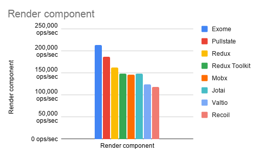
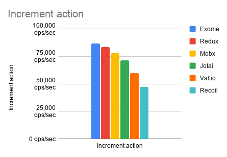

# Benchmarks
I created a simple benchmark to get the gist of how this library performs. I did not create benchmarks to brag or anything (is not my intention to start a fire in a community), it's just an interesting thing to look at.

Also one thing to note is that I disabled batching in valtio as it is avoids sync code and cannot really be benchmarked in a way we can test it.

So I created a simple `counter state` with `increment action` with each library I cared to test and:

|1. Rendered that counter component with initial state|2. Triggered increment action and updated component view|
|-|-|
|||

_Note: **Higher is better**_

I know counter doesn't really show real world app performance, but I didn't want to waste much time re-creating real world app for each state so this will have to do.

# Running benchmarks
There's a cli to run and return results. Tests run on top of `@prantlf/astrobench` library via Playwright.

Before starting, make sure you're in `/benchmark` directory.

To prepare dependencies, run:
```
npm install
```

And to run tests:
```
npm test -- ./react/counter
```

`test` script takes in single arg that points to benchmark directory you want to run.

Currently possible benchmarks are:
```
npm test -- ./react/counter
npm test -- ./react/fields
```
